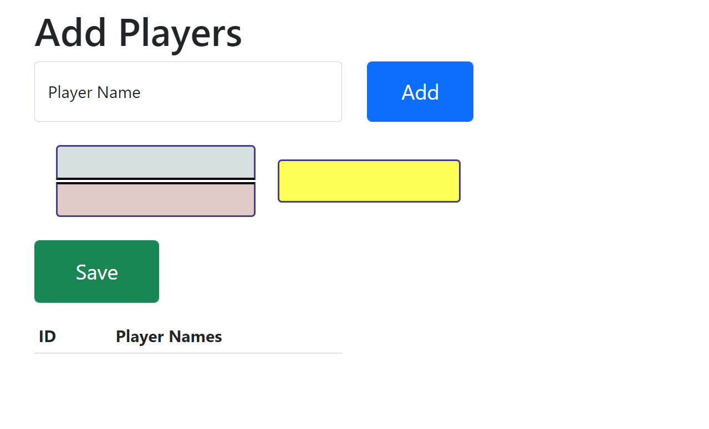

# Bracket Generator

### [Check it out on Firebase](https://bracketgenerator-220.web.app/)

## About

This is a tournament bracket generator.  
The bracket will automatically resize depending on the number of players added.
To advance the players simply click on them.
To delete players, click on the "x" next to them in the list of players.  
Pressing the save button will generate a link to access the bracket you created. Make sure to save after editting.

### Built With

- [React.js](https://reactjs.org/)
- [Node.js](https://nodejs.org/en/)
- [Express.js](https://expressjs.com/)
- [MongoDB](https://www.mongodb.com/)
- [Mongoose](https://mongoosejs.com/)
- [Bootstrap](https://getbootstrap.com)
- [Heroku](https://www.heroku.com/)
- [Firebase](https://firebase.google.com/)

## Prerequisites

- Make sure you have npm
  `npm install npm@latest -g`

## Installation

Only the bracketGenerator folder is needed.  
Edit some some commented code in Bracket.js to run locally.

- Use `npm i` to install all dependencies
- Host at [http://localhost:3000/](http://localhost:5000/) using `npm start`
